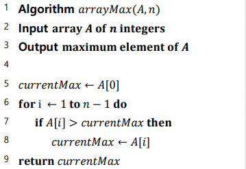

# 1.2 알고리즘의 성능

&#x20; 알고리즘은 데이터를 처리하는 근본적인 해결책 중 하나입니다. 과거에는 컴퓨터의 HW 자원의 성능이 좋지 않았기 때문에 이러한 데이터 관리와 처리는 매우 중요한 요소였습니다. 현대에 HW 자원이 매우 강력해졌지만, 그만큼 처리하는 데이터 양이 방대해졌기 때문에 알고리즘의 성능은 아직도 중요합니다.

&#x20; 앞 장에서도 말씀드린 것처럼 자료구조의 연산들도 일종의 알고리즘이기 때문에 자료구조의 성능은 해당 자료구조에 포함된 연산들의 성능으로 판단합니다.

&#x20; 그렇다면 어떤 알고리즘의 "성능이 좋다"거나 "효율적이다"라고 말하는 기준은 무엇이 될까요? 우리가 보통 효율성을 말할 때는 이익 대비 비용을 고려합니다. 그런데 앞 장에서 말씀드린 것처럼 알고리즘은 반드시 정확해야 하므로 이익에는 변동이 있을 수 없습니다. 따라서 알고리즘의 성능을 얘기할 때는 주로 비용을 얘기하며, 알고리즘의 비용은 **시간**과 **공간**이라는 두 관점으로 계산합니다.

&#x20; 먼저, 시간에 대한 성능 척도는 "알고리즘이 걸리는데 얼마나 걸리는가"입니다. 당연히 알고리즘이 빠를 수록 컴퓨터에 들어가는 전력, 문제를 해결하는데 필요한 시간 자원 등이 감소하니 중요하겠죠.

&#x20; 공간에 대한 성능 척도는 "얼마나 많은 저장 공간이 필요한가"입니다. 컴퓨터가 데이터를 저장하는 공간은 CPU의 레지스터, 주 메모리 RAM, HDD와 SDD 같은 보조 메모리가 있습니다. 하지만 CPU에서 데이터를 사용할 때 HDD와 SDD에 저장된 데이터를 사용하는 것은 굉장히 시간 소모가 큽니다. 그렇다고 레지스터에 있는 데이터만 사용하자니 레지스터는 용량이 너무 작습니다. 그래서 우리는 주로 RAM 용량을 중요하게 생각합니다. 실제로 프로그램이 수행 중인, 또는 수행 가능한 프로세스가 되는 기준은 RAM에 올려졌는가입니다. RAM이 레지스터보다는 용량이 크지만 제한적이므로, 저장 공간을 효율적으로 사용하는 것은 중요합니다.

&#x20; 그렇다면 이러한 성능은 어떻게 계산되고 분석될까요? 실험적 분석 방법과 이론적 분석 방법으로 나뉩니다.

## 실험적 분석 방법

&#x20; 실험적 분석 방법(Experimental studies)는 알고리즘을 실제로 실행하고 측정 및 분석하는 방법입니다. 다양한 경우에 대해서 알고리즘을 테스트하는 것이라고 생각하시면 됩니다.

### 실험 데이터

&#x20; 많은 논문 및 연구에서는 이를 위해 크게 2가지 데이터를 사용하며, 첫번째는 _**실제 데이터(Real data)**_입니다. 먼저, 실제 데이터는 현실 세계에서 제작된 데이터를 의미합니다. 가령, 우리가 단어들을 정렬하는 알고리즘을 테스트한다고 한다면 현실에서 자주 나타나는 단어들을 모아 놓은 데이터나 책들을 사용할 수 있겠죠.

&#x20; 두번째는 _**랜덤 데이터(Random data)**_입니다. 랜덤 데이터는 입력 데이터를 랜덤으로 생성하는 데이터를 의미합니다. 앞선 정렬 알고리즘을 예시로 한다면, 각 단어의 길이와 구성하는 문자를 랜덤으로 구성하여 만들 수 있겠죠. 물론 알고리즘의 실질적인 성능 측정을 위해서는 실제 데이터를 사용한 분석이 좋겠지만 우리가 예상하지 못한 이례적인 데이터도 처리해야 할 수 있기 때문에 랜덤 데이터를 사용한 분석도 유용합니다.

&#x20; 이러한 데이터들을 테스트 케이스(Test case)로써 사용하여 입력으로 가공합니다. 랜덤 데이터는 애초에 입력 형태로 데이터를 만들지만, 앞선 실제 데이터의 책들은 단어들을 랜덤으로 추출하는 등의 가공을 할 수도 있겠죠.

### 실험적 분석 방법의 단점

&#x20; 이러한 실험적 분석 방법은 알고리즘의 성능 측정을 위해 매우 중요하지만, 매우 치명적인 단점들이 존재합니다.

1. **실제로 구현하기 매우 어려울 수 있다.**

&#x20; 앞으로 우리가 공부할 알고리즘들은 매우 간단한 편에 속합니다. 이보다 C나  gcc, Python 등의 표준 라이브러리들에서 사용되는 알고리즘들이 복잡하지만 어느 정도 노력을 기울이면 구현 자체는 할 수 있습니다~~_(구현을 했으니 라이브러리로 존재하겠죠)_~~. 하지만 학계에서 연구하고 있는 알고리즘들이나 실제로 개발 중의 특정한 문제를 해결하기 위해 최적화한 알고리즘 등은 한도 끝도 없이 복잡해질 수 있습니다.

&#x20; 그러나 구현 자체도 시간과 인적 비용이 요구되므로 복잡한 알고리즘을 구현하는 것 자체가 비용을 발생시키며, 정말로 구현하기 어려운 알고리즘들이 많습니다.

2. **실험을 진행한 케이스 외의 성능을 알 수 없다.**

&#x20; 우리가 데이터를 통해 만든 테스트 케이스 외의 경우는 알 수 없습니다. 심지어 우리의 테스트 케이스가 중요한 엣지 케이스(Edge case)를 포함하지 않는다면 추후 치명적인 성능 이슈를 발생시킬 수 있습니다.


_**엣지 케이스(Edge case, Corner case)**_는 일반적인 경우와 다르거나 예외적인 테스트 케이스를 의미하며, 알고리즘의 성능 및 정확도 측정에서 중요한 역할을 합니다. 매우 복잡한 도로들로 구성된 도시에서 길을 찾는 알고리즘을 개발한다고 가정해봅시다. 이때, 교차로가 일종의 분기가 될 것이며, 매우 복잡한 도로들이므로 교차로에 연결된 도로가 매우 많을 것입니다. 이러한 경우, 막다른 길이나 다시 똑같은 곳으로만 돌아오는 도로들이 있는 경우가 엣지 케이스가 될 수 있을 것입니다.



잘 알려진 문제들은 잘 만들어진 _**벤치마크(Benchmark)**_를 사용합니다. 이러한 벤치마크들은 현실에서의 발생 빈도, 엣지 케이스를 비롯한 매우 광범위한 테스트 케이스 등의 속성을 가지고 있습니다. 이러한 벤치마크들을 잘 만들기 위한 연구들도 진행되고 있습니다.


3. **HW 및 SW 환경에 의존적이다.**

&#x20; 실험적 분석 방법의 치명적인 단점 중 하나는 HW 및 SW 환경에 의존적이라는 것입니다. 우리가 흔히 실험을 할 때는 독립 변수와 종속 변수를 나누어 관리합니다. 알고리즘을 실험할 때는 당연히 알고리즘을 수행하는 프로그램만이 독립 변수로 작용해야 합니다. 그러나 인간이 조정하고 측정하는 것이 불가능하거나 어려운 많은 요소들이 존재합니다.

&#x20; HW적으로는 크게는 컴퓨터 기종 및 부품의 차이 등이 있으며 작게는 CPU와 RAM의 물리적 거리, 충전기의 출력 등 매우 사소한 것도 영향을 미치게 됩니다. SW적으로는 컴퓨터가 수행 중인 다른 프로그램들이 영향을 미칠 수 있으며, 심지어 OS(Operating system)도 영향을 미칩니다. 하다못해, 알고리즘을 수행하는 파일의 위치와 실제 수행할 때 저장되는 메모리 상의 위치 등도 영향을 미치게 됩니다.

&#x20; 이러한 다양한 이유들로 인해 다른 알고리즘 간의 성능 비교가 어려우며, 같은 알고리즘에 대해서도 성능 차이가 발생할 수 있습니다.


그래서 알고리즘 논문들은 실험 결과를 기재할 때, 어떤 CPU, RAM, OS, 컴파일러, 최적화 버전 등에서 수행했는지 기재합니다.


## 이론적 분석 방법

<figure><figcaption>
최대 수 찾기 의사 코드
</figcaption></figure>

&#x20; 이론적 분석 방법(Theoretical analysis)는 앞서 언급한 실험적 분석 방법의 단점들을 모두 해결합니다. 실제로 알고리즘을 구현하지 않고 가상의 수행 시간과 공간의 사용 크기를 계산합니다. 테스트 케이스들을 일반화하여 입력의 크기에 대한 함수의 형태로 분석합니다. 그러므로 모든 경우에 대한 성능 지표를 제공하며, 환경에 독립적입니다.

&#x20; 이론적 분석 방법의 가장 기본적인 방법은 알고리즘을 High-level description인 _**의사 코드(Pseudocode)**_로 작성하여 실제 수행하는 연산들을 세는 것입니다.


컴퓨터공학에서 프로그래밍 언어나 표현에 대해 High-level, Low-level이라고 하는 것은 인간 또는 기계에 얼마나 친화적인가라고 생각하시면 됩니다. 높은 수준일수록 컴퓨터의 특징이나 속성에 대한 것들을 숨깁니다. 보통 추상화(Abstraction)한다고 합니다. 예를 들어, Python은 높은 수준의 언어라고 할 수 있으며, 컴퓨터가 이해하는 0과 1로 구성된 기계어는 가장 낮은 수준의 언어라고 할 수 있습니다.


### 의사 코드

&#x20; 의사 코드는 크게 알고리즘의 이름, 입력, 출력, 알고리즘의 구성으로 이루어집니다. 위 이미지는 데이터들이 일렬로 저장된 형태인 배열에서 가장 큰 수를 찾는 알고리즘의 의사 코드입니다. 맨 위에는 알고리즘의 이름 $$arrayMax$$가 알고리즘의 이름이고 그 아래에 입력과 출력, 알고리즘의 구성 순으로 기재되어 있습니다.

&#x20; 위 이미지에서 보이는 것처럼 의사 코드는 우리가 사용하는 프로그래밍 언어들과 유사하며 그에 따라 정해진 몇몇 규칙들이 있습니다. 이러한 규칙들은 일종의 관행으로 여겨지므로 사람마다 작성하는 방식은 다를 수 있습니다. 그럼에도 다 한눈에 알아볼 수 있으니 걱정할 필요는 없습니다. 몇몇 헷갈릴 수 있는 기호들은 아래 표를 참고해주세요.

<table data-full-width="false"><thead><tr><th width="161.5">기호</th><th>설명</th></tr></thead><tbody><tr><td> \leftarrow </td><td>할당 연산(Assignment operation).  A \leftarrow B 는 변수 B의 값을 A에 할당한다는 의미이다.</td></tr><tr><td> = </td><td>동등 비교 연산(Equality comparision operation).</td></tr><tr><td> \textrm{for }...\textrm{ do } ...</td><td>[반복문] \textrm{for}와 \textrm{do} 사이에는 반복되는 조건이, \textrm{do} 뒤에는 반복 수행될 코드가 작성되며 들여쓰기로 구분된다.</td></tr><tr><td> \textrm{while }...\textrm{ do } ... </td><td>[반복문] \textrm{for}&#x26;\textrm{do}와 동일</td></tr><tr><td>\textrm{repeat }...\textrm{ until } ...</td><td>[반복문] \textrm{repeat}과 \textrm{until} 사이에는 반복 수행될 코드가 작성되며 들여쓰기로 구분된다. \textrm{until} 뒤에는 조건이 작성된다.</td></tr></tbody></table>

&#x20; 이러한 규칙들이 있지만, 의사 코드는 High-level description이므로 프로그래밍 언어들이나 컴파일러, 컴퓨터에 종속된 여러 요소들을 무시합니다. 위 최대 수 찾기의 의사 코드를 보면 변수들의 자료형을 고려하지 않으며 선언도 제대로 하지 않고 사용하기도 합니다.

### 수행 연산 세기

&#x20; 자, 그러면 의사 코드의 연산을 어떻게 세야 할까요? 우리는 단위의 역할을 하는 기본 연산(Primitive operation)들을 셀 것입니다. 종류는 보통다음과 같습니다.&#x20;

